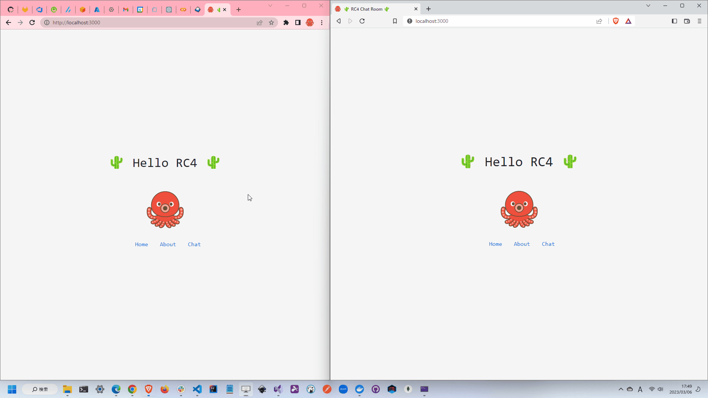

# RC4-chat-room

🌵🌵🌵 RC4暗号を使用して特定のキーを持っているユーザのみがメッセージを読めるチャットルームです。  

  

## 開発環境の構築

### クライアント

```shell
yarn --pwd ./client install
yarn --pwd ./client dev
```

### サーバ

```shell
dotnet run --project ./server
```
